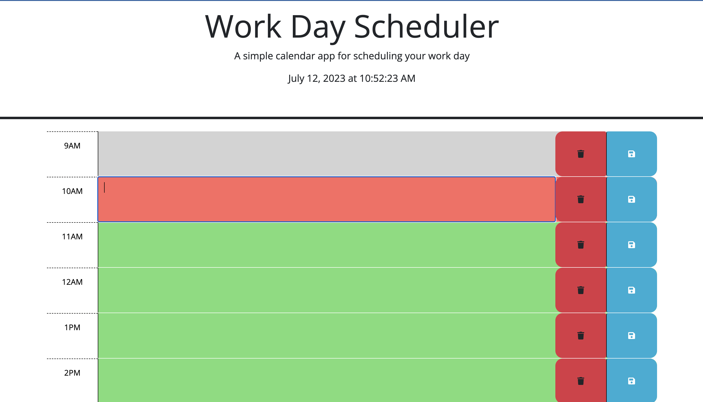
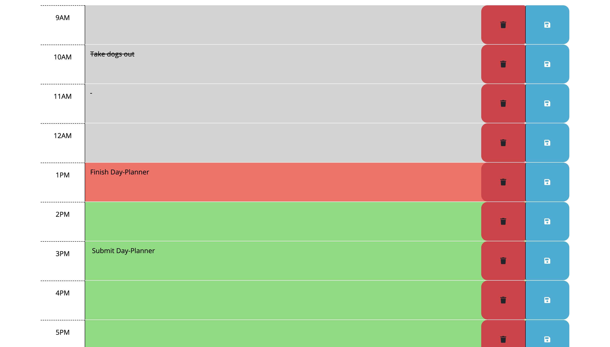

# Work-Day-Scheduler

## Technology Used, Deployment, and Repository

| Technology Used         | Resource URL           | 
| ------------- |:-------------:| 
| HTML          | [https://developer.mozilla.org/en-US/docs/Web/HTML](https://developer.mozilla.org/en-US/docs/Web/HTML) |
| Dayjs          | [https://day.js.org/docs/en/display/format](https://day.js.org/docs/en/display/format) |
| Javascript    | [https://developer.mozilla.org/en-US/docs/Web/JavaScript](https://developer.mozilla.org/en-US/docs/Web/JavaScript) |   
| Git | [https://git-scm.com/](https://git-scm.com/)     | 
| Deployed Site | [https://shirvanyankaren.github.io/Work-Day-Scheduler/](https://shirvanyankaren.github.io/Work-Day-Scheduler/)     | 
| My Github Repository | [https://github.com/ShirvanyanKaren/Work-Day-Scheduler](https://github.com/ShirvanyanKaren/Work-Day-Scheduler)     | 

## Description

This project was an on-the-job ticket that encompassed creating a javascript file utilizing jquery syntax, dayjs, and localStorage to allow the user to store events according to the time of the day with corresponding color coordination to represent past, present, and future events. The day-planner had to meet the following acceptance criteria:

```md
GIVEN I am using a daily planner to create a schedule
WHEN I open the planner
THEN the current day is displayed at the top of the calendar
WHEN I scroll down
THEN I am presented with timeblocks for standard business hours
WHEN I view the timeblocks for that day
THEN each timeblock is color coded to indicate whether it is in the past, present, or future
WHEN I click into a timeblock
THEN I can enter an event
WHEN I click the save button for that timeblock
THEN the text for that event is saved in local storage
WHEN I refresh the page
THEN the saved events persist
```

The finished day planner application is presented below:



## Table of Contents

* [Javascript, Dayjs, and Local Storage](#javascript-dayjs-and-local-storage)
* [Usage](#usage)
* [Learning Points](#learning-points)
* [Credits](#credits)
* [License](#license)

## Javascript, Dayjs, and Local Storage

The first course of action for this project required the integration of html and css for the layout of each individual page of the quiz. Throughout this process, I also applied ids to the html elements to manipulate them in javascript later.

The first step in this project was to modify the HTML to include all the times of 9am to 5pm which was done by copying the existing sections and modifying their listed times.

```html
 <div id="9" class="row time-block">
        <div class="col-1  hour text-center py-3">9AM</div>
        <textarea class="col-9  description" rows="3"> </textarea>
        <button class="btn deleteBtn col-1 bg-danger" aria-label="save">
          <i class="fas fa-trash" aria-hidden="true"></i>
        </button>
        <button class="btn saveBtn col-1 " aria-label="save">
          <i class="fas fa-save" aria-hidden="true"></i>
        </button>
      </div>
      ...
 <div id="17" class="row time-block">
        <div class="col-1 hour text-center py-3">5PM</div>
        <textarea class="col-9 description" rows="3"> </textarea>
        <button class="btn deleteBtn col-1 bg-danger" aria-label="save">
          <i class="fas fa-trash" aria-hidden="true"></i>
        </button>
        <button class="btn saveBtn col-1 " aria-label="save">
          <i class="fas fa-save" aria-hidden="true"></i>
        </button>
      </div>

```
I also included an id number and removed the past, present, and future classes in order to add and manipulate them later in javascript. 

```js
function updateTime() {
  const currentDateTime = dayjs().format('MMMM DD, YYYY [at] hh:mm:ss A');
  document.getElementById('currentDay').textContent = currentDateTime;
}

setInterval(updateTime, 1000);
```
I created a function to update time with the proper dayjs format and set and interval to change every second.

The next step was to compare this current day value and add either the past, present, or future class with an if statement. This was done by selecting each time block with a function and applying the following if statement.

```js
if (currentDate > scheduleTime) {
      $(this).addClass("past");
  } else if (currentDate < scheduleTime) {
      $(this).addClass("future");
  } else {
      $(this).addClass("present");
  }
```

The last step was to allow the user to save their plans within the given time blocks after they saved. This was accomplished with the following javascipt event lister and for loop. 

```js

$('.saveBtn').on('click', function(){
var textarea = $(this).siblings('textarea').val()
var parentID = $(this).parent().attr('id')
localStorage.setItem(parentID, textarea)
});

function enterText() {
  for (let i = 9; i < 18; i++) {
    var timeBlock = document.getElementById(i);
    var textarea = timeBlock.querySelector("textarea");
    var storage = localStorage.getItem(i);

    if (storage != null) {
      textarea.value = storage;
    }
  }
}
```

The event listener and sequential anonymous function above effectively targets the text area value that the user inputs along with the id time tag given the button they press. The specific text is selected through the jquery traversing methods of siblings and parent and stored in localStorage. The function enterText then runs a for loop that runs through each id time tag and displays the stored item into the text area given the value is not null. 

I also addressed the edge case of the user wanting to change their plans by adding a delete button that cleared the local storage for that given time block.




## Usage 

This application can be utilized by the user to plan out their days through adding events to each given timeblock. The application automatically shows the current time, and displays to the user which events are current, upcoming or in the past. The use of localStorage ensures that the user will not lose the event after saving and refreshing the page. 


## Learning Points

Through this project, I learned a lot about the utilization of jquery, dayjs, and localStorage. The jquery syntax for selecting elements in the HTML through direct targeting and through traversing was complicated at first, but proved to be a shorter and easier method of utilizing javascript to manipulate HTML elements. Although I have used localStorage and for loops in previous projects, after this project the application of both these techniques really clicked for me as I realized just how multifaceted they are. 


## Credits

Philip Loy from the Central Tutoring Center helped me garner an understanding of local storage and jquery syntax. I also utilized the following resources for this project.

* [JQuery](https://www.w3schools.com/jquery/jquery_syntax.asp)
* [JQuery Events](https://www.w3schools.com/jquery/jquery_events.asp)
* [Storage](https://developer.mozilla.org/en-US/docs/Web/API/Web_Storage_API)
* [Loops](https://www.w3schools.com/js/js_loop_for.asp)
* [localStorage.setItem](https://developer.mozilla.org/en-US/docs/Web/API/Storage/setItem)

## License 

MIT licensing with permisions such as commercial use, modification, distribution and private use. Limitations include liability and warranty.
